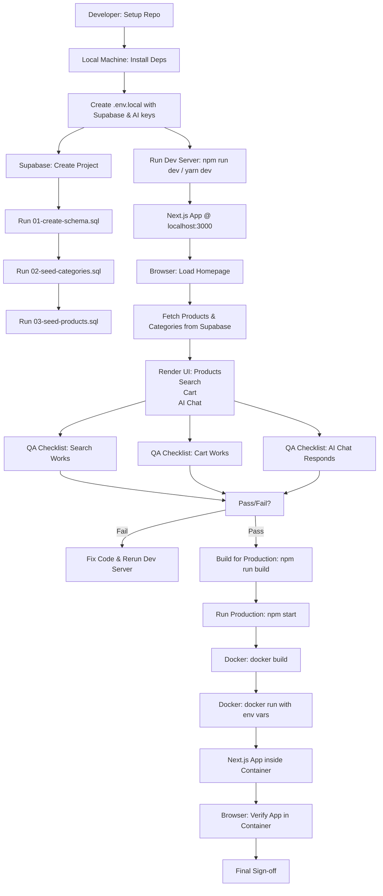

# 🛒 Walmart Demo Store (Gemma API)
[]()
[]()
[]()
[]()
[]()
[]()
[]()
[]()
[]()

---

> **Project snapshot:** A production-feel Shopify/Walmart-style storefront built with Next.js (App Router), Supabase for backend/data, Tailwind CSS for UI, and an integrated AI shopping assistant. This repo is a fully interactive demo used for prototyping e-commerce flows: products, categories, search & filters, cart, and conversational assistant.

---

## Table of Contents

- [What is this?](#what-is-this)  
- [Highlights & Features](#highlights--features)  
- [Tech Stack](#tech-stack)  
- [Architecture (quick view)](#architecture-quick-view)  
- [Getting Started (Local)](#getting-started-local)  
- [Docker (Containerized run)](#docker-containerized-run)  
- [Supabase: Database & Seeding](#supabase-database--seeding)  
- [Environment Variables](#environment-variables)  
- [Developer Notes & Tips](#developer-notes--tips)  
- [Testing & QA Checklist](#testing--qa-checklist)  
- [Extensibility & Roadmap](#extensibility--roadmap)  
- [Contributing](#contributing)  
- [License](#license)  
- [Credits & Acknowledgements](#credits--acknowledgements)

---

## What is this?

This repo contains a **Walmart-inspired storefront** demo built with Next.js (App Router). It demonstrates an end-to-end front-end experience backed by Supabase:

- Product listing, categories, search & filtering, pagination  
- Cart & checkout flow state (client-side)  
- AI-powered shopping assistant chat (server API → AI SDK)  
- Database seeds (SQL) to populate sample categories & products  
- UI primitives & components (radix/shadcn-style components + Tailwind)

> Purpose: showcase a realistic e-commerce front-end + lightweight server integration suitable for hackathons, demos, or as a starter template.

---

## Highlights & Features

- Polished UI built with Tailwind + component primitives (`components/ui/*`)  
- Product catalog with categories, featured products, filters & pagination  
- Cart context & persistence (client-side state management)  
- Server-side API routes (Next.js app/api/*) backed by Supabase queries  
- AI Assistant: `app/api/chat/route.ts` — uses an AI SDK to generate shopping assistant responses (product recommendations, deal hints, comparisons)  
- SQL seed scripts: `scripts/02-seed-categories.sql`, `scripts/03-seed-products.sql` (sample data)  
- Ready for containerized deployment (Dockerfile + Next.js production build scripts)

---

## Tech Stack

- **Framework:** Next.js 15 (App Router)  
- **Data:** Supabase (Postgres) — client/server helpers in `lib/supabase/*`  
- **UI:** Tailwind CSS, Radix UI (via `components/ui/`), Geist fonts  
- **AI:** `@ai-sdk/openai` integration (server-side route)  
- **Language:** TypeScript / React (Client & Server components)  
- **Tooling:** Docker, npm scripts (dev/build/start)

---

## Architecture — quick view



# Getting started (Local dev)

**Prereqs:** Node.js (v16+ recommended), npm/yarn, a Supabase project (free tier OK).

---

## Unzip & install

> From project root (where `package.json` lives)

```bash
npm install
# or
yarn
```

---

## Environment configuration

1. Create a `.env.local` in the project root (see full env list below) and populate with your Supabase and AI keys.
2. Set up Supabase (see next section) — create tables & run SQL seeds.

---

## Run dev server

```bash
npm run dev
# or
yarn dev
# Visit: http://localhost:3000
```

---

## Build / Production (locally)

```bash
npm run build
npm start
```

---

# Docker (containerized run)

A basic `Dockerfile` is included for producing a production-like image.

### Build

```bash
docker build --platform linux/amd64 -t walmart-demo .
```

### Run (mount input/output if needed)

```bash
docker run --rm \
  -p 3000:3000 \
  -e NEXT_PUBLIC_SUPABASE_URL="https://xyz.supabase.co" \
  -e NEXT_PUBLIC_SUPABASE_ANON_KEY="public-anon-key" \
  -e OPENAI_API_KEY="sk-..." \
  walmart-demo
```

> The container expects environment variables—see the dedicated **Environment Variables** section below.

---

# Supabase — Database & Seeding

This project expects a Postgres schema compatible with the SQL seed files located in `scripts/`.

### Recommended flow

1. Create a new Supabase project at [https://app.supabase.com](https://app.supabase.com)
2. In the Supabase dashboard → **SQL Editor**, paste & run:

   * `scripts/01-create-schema.sql` (if present) — creates tables
   * `scripts/02-seed-categories.sql` — adds categories
   * `scripts/03-seed-products.sql` — populates products

If you prefer CLI: `supabase db push` or `psql` can run the SQL files. The seed SQLs reference columns like `products` and `categories` — inspect them and adjust if your Supabase schema differs.

### Tables expected (high level)

* `categories` — `id`, `name`, `slug`, `image`
* `products` — `id`, `name`, `description`, `price`, `image_url`, `category_id`, `is_featured`, `rating`
* `users` — (auth via Supabase Auth if used)

---

# Environment Variables

Place these in `.env.local` (Next.js consumes them at build/runtime):

```env
# Supabase (PUBLIC keys used in client & server helpers)
NEXT_PUBLIC_SUPABASE_URL=https://xyz.supabase.co
NEXT_PUBLIC_SUPABASE_ANON_KEY=public-anon-key

# (Optional) If server-side actions require service role:
SUPABASE_SERVICE_ROLE_KEY=service-role-key

# AI / OpenAI SDK
OPENAI_API_KEY=sk-your-openai-key

# Next config — (if you deploy under a different domain)
NEXT_PUBLIC_APP_URL=http://localhost:3000
```

> **Security note:** Never commit `.env` to source control. Use GitHub Actions secrets or your cloud provider's secret manager for deployments.

---

# Dev Notes & Implementation Highlights

* **Product fetching & filtering** lives in `app/api/products/route.ts` and `lib/api/products.ts` (client wrappers).
* **Search:** `app/api/search/route.ts` supports query, category filtering, price range, and pagination.
* **AI Assistant:** `app/api/chat/route.ts` uses `@ai-sdk/openai` and a `systemPrompt` (see route file) to tailor answers; the assistant augments product recommendations with context from Supabase.
* **UI Composition:** `components/*` includes modular UI slices (header, product cards, category grid, AI chat bubble, search filters).
* **State Management:** `contexts/cart-context.tsx` and `contexts/chat-context.tsx` provide local state and methods for cart and chat flows.

---

# Testing & QA Checklist

Use this checklist before submission or demo:

* [ ] Environment variables set (Supabase & AI keys).
* [ ] Supabase seeded with sample categories/products.
* [ ] `npm run dev` loads home page and categories.
* [ ] Product search returns relevant items and supports filters.
* [ ] Cart add/remove/quantity works and totals update correctly.
* [ ] AI chat responds and recommends sample products (requires `OPENAI_API_KEY`).
* [ ] `npm run build` completes without errors.
* [ ] App runs in Docker container (`docker run`) and responds on port 3000.

---

# Extensibility & Roadmap (Ideas)

* **Checkout integration** — connect to Stripe (or other) to simulate orders.
* **Persistent cart** — store cart in Supabase per-user (requires auth).
* **Admin Panel** — allow product CRUD from a private dashboard.
* **Enhanced AI** — use embeddings to surface product similarity and personalized recommendations.
* **Image-based search** — add an image upload route that finds visually similar products.
* **A/B experiments** — fold in feature toggles for UI/UX experiments.

---

# Troubleshooting (common issues)

* **Blank page / 500 on startup** — ensure `NEXT_PUBLIC_SUPABASE_URL` and anon key are set.
* **AI chat returns errors** — confirm `OPENAI_API_KEY` is valid and has usage left; review `app/api/chat/route.ts` logs.
* **Products don't show** — check that SQL seed scripts ran successfully and tables contain rows.
* **CORS / network issues in production** — make sure your deployment platform allows outgoing requests to Supabase and any AI endpoints during build/runtime (note: challenge rules may require network-offline runtime — adapt accordingly).

---

# Contribution & Collaboration

Love this as a starting point? Awesome — please:

1. Fork the repo
2. Create a feature branch: `git checkout -b feat/awesome-thing`
3. Commit your changes: `git commit -m "feat: add awesome thing"`
4. Open a PR and describe the motivation & changes

**Style conventions:** TypeScript, functional React components, Tailwind for styling. Keep components small & composable.

